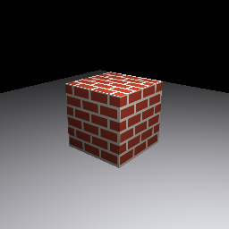

# RasterizedCube

Rasterizes a textured cube resting on a ground plane, lit by a point light, and writes
the result to `output.ppm` (256×256). It renders the **same scene** as
[RayTracedCube](../RayTracedCube) — same camera, light, geometry, materials, and brick
texture — but through the raster pipeline instead of ray queries.

Demonstrates: render pipeline + vertex descriptor, a vertex/fragment shader pair, a
depth buffer, per-object draws with model/view/projection matrices, point-light
(Blinn-Phong) shading in the fragment stage, texture sampling through a real
`MTLSamplerState` (linear-filtered), rendering to an offscreen color attachment, and
readback to the CPU — the full rasterization path through MoltenMTL.

The scene lives in [`Scene.swift`](Sources/RasterizedCube/Scene.swift) — a copy of
RayTracedCube's, with camera view/projection matrices added (the only thing raster needs
that ray tracing didn't).

<p align="center">
  
  &nbsp;&nbsp;
  
</p>
<p align="center"><em>Same scene: ray-traced (left) vs rasterized (right).</em></p>

## Requirements

- Windows 10/11 (64-bit)
- Vulkan SDK ≥ 1.3 — [download](https://vulkan.lunarg.com/sdk/home)
- Swift 6.2+ — [download](https://www.swift.org/install/windows/)
- `VULKAN_INSTALL` pointing at your SDK root:
  ```
  set VULKAN_INSTALL=C:\VulkanSDK\1.4.341.1
  ```

## Build & Run

From this directory:

```
swift run
```

The `Shaders/cube.vert` and `cube.frag` shaders are compiled to SPIR-V automatically as
part of the build by the `CompileShaders` plugin, so there are no separate steps.

Expected output:
```
[MoltenMTL] GPU: <your GPU name>
[MoltenMTL] Device ready (compute queue family: 0)
Cube rendered ✓
Wrote <path>\output.ppm
```

Open `output.ppm` with any image viewer (IrfanView, GIMP, or a VS Code PPM extension).

## Editing the shaders

Edit `Shaders/cube.vert` / `cube.frag` and re-run `swift run` — the build recompiles
them to SPIR-V for you. There are no checked-in `.spv`; they are build artifacts.
