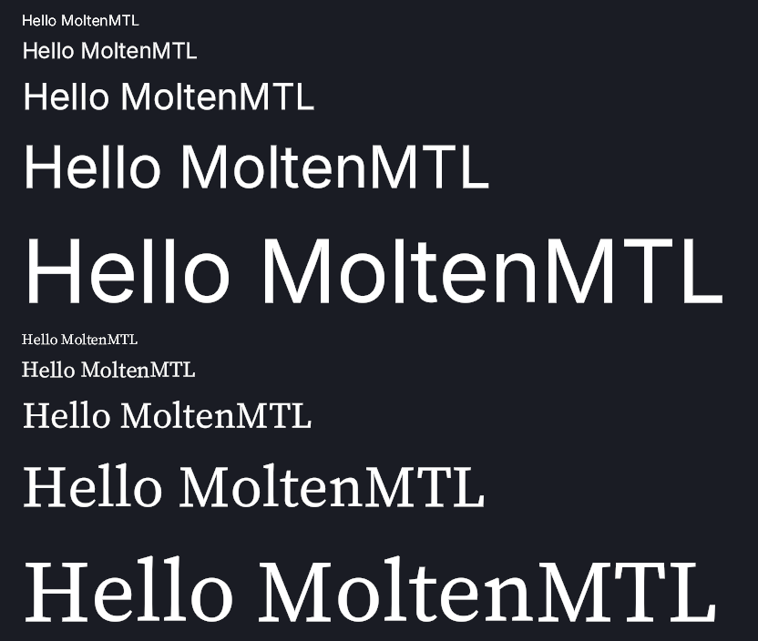

# SDFTextSimple

MSDF text rendering, kept minimal: the same line drawn in two fonts (sans and serif)
at five sizes each — ten lines, batched into one instanced draw call per font, one
output image. All the text-rendering logic lives in this example (the shared
`ExampleSupport` helpers cover only device setup and image output). The
reusable rendering pieces (atlas decode, em-unit glyph table, pen walk, pipeline,
shaders) sit in their own files under
[`Sources/SDFTextSimple`](Sources/SDFTextSimple) —
[`FontAtlas.swift`](Sources/SDFTextSimple/FontAtlas.swift),
[`TextRasterizer.swift`](Sources/SDFTextSimple/TextRasterizer.swift) — and
[`main.swift`](Sources/SDFTextSimple/main.swift) is the harness that wires MoltenMTL to
them: font assets, render target, text-element list, PPM readback.

<p align="center">
  
</p>

## One atlas per font — never per size

Every size of a font samples the **same atlas**: the glyph table stores em units, the
per-draw uniform carries `sizePx`, and the fragment shader's `screenPxRange()`
re-derives ~1 px of anti-aliasing at whatever scale the text lands on screen. Two
fonts means two atlases (an atlas is a picture of specific letterforms); five sizes
mean nothing at all. The one rule is bake density: `-size` at bake time should be ≥
the largest pixel size you draw (both atlases here: 96, matching the largest line).

## The idea: sequential work on the CPU, parallel work on the GPU

A glyph's x-position is the running sum of the advances of every glyph before it —
inherently sequential (this accumulation is the "pen walk", and it is where kerning
would fold in too). So it runs **once per line on the CPU** (a handful of lines,
microseconds) and only its *result* is uploaded: one 16-byte record per character
(`{glyphIndex, sizePx, position}`), carrying the glyph's absolute pen position. Because
each record is self-contained, every string and every size that share a font batch into
one buffer and one instanced draw call.

```
string ──pen walk──▶ {glyphIndex, sizePx, position} records ──▶ vertex shader: pure lookups
<font>.json ───────▶ dense glyph table + unicode→index map ──┘  (no loops, no layout logic)
<font>.bin ────────▶ MSDF texture ──▶ fragment shader: distance → opacity
```

Because each character's one sequential dependency was resolved before upload, every
GPU invocation (6 corners × N characters, then thousands of fragments) is fully
independent — the GPU can run them all at the same time.

- **Character buffer** — `{glyphIndex, sizePx, position}` per character (16 bytes); one
  buffer per font, holding every string at every size.
- **Glyph table** — one dense slot per atlas glyph, in atlas file order, in em units:
  quad bearing/size + atlas UV rect. A separate `unicode → index` map resolves a
  codepoint to its slot, falling back to `?` for anything the atlas doesn't carry. One
  table per font serves all sizes; invisible glyphs have `size == 0`, so their zero-area
  quad rasterizes no pixels.
- **Vertex shader** ([`TextRaster.vert`](Shaders/TextRaster.vert)) — fetch record, fetch table
  entry, `position + (bearing + corner × size) × sizePx`, convert pixels → NDC. The two
  triangles per glyph exist because the rasterizer only accepts triangles — they are
  the request for "run the fragment shader over this rectangle". The quad origin is
  rounded to a whole pixel (pixel snapping) so every occurrence of a letter lands on
  the same sub-pixel phase and renders identically. This is not hinting: strokes
  inside the glyph may still sit fractionally.
- **Fragment shader** ([`TextRaster.frag`](Shaders/TextRaster.frag)) — sample the MSDF atlas,
  `median(r, g, b)` → distance, `screenPxRange()` → ~1 px anti-aliasing ramp,
  output white with that opacity; the alpha blend composites it over the background.

## What a bigger system adds on top of this

Retained text elements with cached meshes and dirty flags (re-layout only when a
string/size/color changes; moving is a uniform update), per-glyph color, and multi-line
layout. (Missing-glyph fallback is already here: any codepoint the atlas doesn't carry
resolves to `?`.) Alternatives considered and why not: an in-shader
pen loop is possible but O(n²); a compute prefix-sum pays off only at enormous glyph
counts; and real layout (wrapping, alignment) needs the pen walk's results on the CPU
anyway.

## Color: blending happens in linear light

The render target is `.rgba8Unorm_srgb`, so the hardware blends in linear light and
re-encodes on store; on a plain Unorm target the anti-aliased edge pixels come out
roughly half as bright as they should (thin, dark-fringed strokes). The clear color
is therefore written in linear values, white text needs no conversion (1.0 is 1.0 in
both spaces), and the atlases stay `.rgba8Unorm` — distances are data, not colors.

## Requirements

- Windows 10/11 (64-bit)
- Vulkan SDK ≥ 1.3 — [download](https://vulkan.lunarg.com/sdk/home)
- Swift 6.2+ — [download](https://www.swift.org/install/windows/)
- `VULKAN_INSTALL` pointing at your SDK root:
  ```
  set VULKAN_INSTALL=C:\VulkanSDK\1.4.341.1
  ```

## Build & Run

From this directory:

```
swift run
```

Expected output:
```
[MoltenMTL] GPU: <your GPU name>
[MoltenMTL] Device ready (compute queue family: 0)
Text rendered ✓ (10 lines, 2 fonts × 5 sizes, one atlas per font)
Wrote <path>\output.ppm
```

Open `output.ppm` with any image viewer at **100% zoom** (IrfanView with resampling
off is ideal; note that Windows display scaling above 100% will blur any image).

## Assets

Two pre-baked atlases, regenerable with [msdf-atlas-gen](https://github.com/Chlumsky/msdf-atlas-gen):

```
msdf-atlas-gen.exe -font Inter-Regular.otf        -type mtsdf -format bin -size 96 -pxrange 4 -yorigin top -imageout inter.bin       -json inter.json
msdf-atlas-gen.exe -font SourceSerif4-Regular.otf -type mtsdf -format bin -size 96 -pxrange 4 -yorigin top -imageout sourceserif.bin -json sourceserif.json
```

Both fonts are SIL Open Font License 1.1: [Inter](https://github.com/rsms/inter)
([`OFL-Inter.txt`](Sources/SDFTextSimple/Assets/OFL-Inter.txt)) and
[Source Serif 4](https://github.com/adobe-fonts/source-serif)
([`OFL-SourceSerif.txt`](Sources/SDFTextSimple/Assets/OFL-SourceSerif.txt)).
The font files themselves are not checked in — only the baked atlases.
