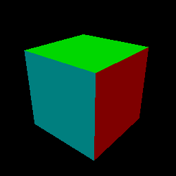

# MoltenMTL
> ⚠️ **Work in progress.** The compute pipeline, acceleration structures (BLAS/TLAS), and ray tracing via **ray queries** are implemented. The render (vertex/fragment) pipeline is the next milestone.

MoltenMTL - A Swift library that lets you write GPU code against Apple's **Metal API** - `MTLDevice`, `MTLCommandBuffer`, `MTLTexture`, etc.. - and have it compile and run on **Vulkan**. Similar to [MoltenVK](https://github.com/KhronosGroup/MoltenVK): where MoltenVK translates Vulkan into Metal on Apple hardware, MoltenMTL translates the Metal API surface into Vulkan on Windows (and hopefully eventually Linux).

There is **no shader translation**. Shaders are plain SPIR-V, consumed natively by Vulkan. The `MTL*` wrappers are thin Swift classes that hold Vulkan handles directly, so the runtime overhead of using this library over raw Vulkan is negligible.

<p align="center">
  
  <br>
  <em>A cube ray-traced on the GPU via Metal acceleration structures (BLAS/TLAS) running on Vulkan - see the <a href="Examples/RayTracedCube">RayTracedCube</a> example.</em>
</p>

---

## Status

| Feature | Status |
|---|---|
| `MTLDevice` / `MTLCommandQueue` | ✅ Done |
| `MTLBuffer` (shared + private storage) | ✅ Done |
| `MTLTexture` / `MTLTextureDescriptor` | ✅ Done |
| `MTLHeap` | ✅ Done |
| `MTLComputeCommandEncoder` | ✅ Done |
| Acceleration structures — BLAS / TLAS | ✅ Done |
| Ray queries (`VK_KHR_ray_query`) from compute shaders | ✅ Done |
| `CAMetalLayer` / `CAMetalDrawable` (swapchain) | ✅ Done |
| `MTLBlitCommandEncoder` (copy, upload) | ✅ Done |
| Render pipeline / fragment shaders | 🚧 Planned |
| Argument buffers (`MTLArgumentEncoder`) | 🚧 Stub — no-op |

---

## Requirements

- **Windows 10/11** (64-bit) - the only tested platform for now
- **[Vulkan SDK](https://vulkan.lunarg.com/sdk/home)** ≥ 1.3 with ray-tracing extensions (`VK_KHR_acceleration_structure`, `VK_KHR_ray_query`)
- **Swift 6.2+** ([Swift for Windows](https://www.swift.org/install/windows/))
- The `VULKAN_INSTALL` environment variable must point to your SDK root before building:
  ```
  set VULKAN_INSTALL=C:\VulkanSDK\1.4.341.1
  ```

---

## Examples

| Example | Description |
|---|---|
| [SimpleCompute](Examples/SimpleCompute) | Doubles a buffer of integers on the GPU - minimal end-to-end walkthrough |
| [RayTracedCube](Examples/RayTracedCube) | Builds BLAS/TLAS acceleration structures and ray-casts a cube in a compute shader, writing the image above to a PPM file |

---

## Getting Started

### Add as a Swift Package dependency

```swift
// Package.swift
.package(url: "https://github.com/Nishad-Sharma/MoltenMTL.git", branch: "main"),
```

```swift
// Your target
.target(name: "MyApp", dependencies: ["MoltenMTL"]),
```

### Minimal compute dispatch

```swift
import MoltenMTL

// 1. Initialise the GPU device (picks the first Vulkan-capable adapter)
guard let device = MTLCreateSystemDefaultDevice() else {
    fatalError("No Vulkan-capable GPU found")
}

// 2. Load a SPIR-V compute shader
guard let library  = device.makeLibrary(path: "myKernel.spv"),
      let function = library.makeFunction(name: "main") else {
    fatalError("Failed to load shader")
}

// 3. Compile the compute pipeline (SPIR-V bindings are reflected automatically)
let pso = try device.makeComputePipelineState(function: function)

// 4. Allocate a shared (CPU + GPU) buffer
let buffer = device.makeBuffer(length: 1024, options: .storageModeShared)!
buffer.contents().storeBytes(of: UInt32(42), as: UInt32.self)

// 5. Record and submit work
let queue     = device.makeCommandQueue()!
let cmdBuf    = queue.makeCommandBuffer()!
let encoder   = cmdBuf.makeComputeCommandEncoder()!

encoder.setComputePipelineState(pso)
encoder.setBuffer(buffer, offset: 0, index: 0)
encoder.dispatchThreadgroups(MTLSize(width: 64), threadsPerThreadgroup: MTLSize(width: 64))
encoder.endEncoding()

cmdBuf.commit()
cmdBuf.waitUntilCompleted()
```

### Explicit binding layout (when not using SPIR-V reflection)

If your shader is loaded without SPIR-V data, or you want to specify the layout explicitly, use `MTLComputePipelineDescriptor`:

```swift
let desc = MTLComputePipelineDescriptor()
desc.computeFunction         = function
desc.storageBufferCount      = 2   // bindings 0, 1
desc.accelerationStructureCount = 1   // binding 2
desc.storageImageCount       = 1   // binding 3

let pso = try device.makeComputePipelineState(descriptor: desc)
```

Binding slots are assigned in order: storage buffers → acceleration structures → storage images.

---

## Architecture

Each `MTL*` type wraps a Vulkan handle directly. `MTLDevice` holds a `VkDevice`, `MTLCommandBuffer` holds a `VkCommandBuffer`, and so on. Method calls forward to the corresponding Vulkan function with minimal overhead.

| Metal type | Vulkan backing |
|---|---|
| `MTLDevice` | `VkInstance` + `VkPhysicalDevice` + `VkDevice` + queue + VMA allocator |
| `MTLCommandQueue` | `VkQueue` + `VkCommandPool` |
| `MTLCommandBuffer` | `VkCommandBuffer` |
| `MTLBuffer` | `VkBuffer` + VMA allocation |
| `MTLTexture` | `VkImage` + `VkImageView` |
| `MTLHeap` | `VmaPool` (sub-allocation) |
| `MTLComputePipelineState` | `VkPipeline` + `VkPipelineLayout` + `VkDescriptorSetLayout` |
| `MTLAccelerationStructure` | `VkAccelerationStructureKHR` |
| `CAMetalLayer` / `CAMetalDrawable` | `VkSwapchainKHR` + per-image `VkSemaphore`s |

Memory management uses [VMA (Vulkan Memory Allocator)](https://github.com/GPUOpen-LibraryForSDKs/VulkanMemoryAllocator). `.shared` buffers are persistently host-mapped; `.private` buffers are GPU-only (`DEVICE_LOCAL`).

## Known Limitations

- **Windows only** for now. Linux support is planned but untested.
- **Compute only.** The render pipeline (vertex/fragment shaders, render passes, render command encoders) is not yet implemented.
- **Ray tracing is ray queries only** (inline ray tracing in compute shaders, via `VK_KHR_ray_query`). The Vulkan ray-tracing pipeline (`VK_KHR_ray_tracing_pipeline` - raygen/hit/miss stages, shader binding tables) and Metal intersection function tables are not supported. This matches Metal's own model, where rays are traced by calling `intersect()` from compute shaders.
- **`MTLArgumentEncoder`** methods are no-ops. Vulkan uses descriptor sets for resource binding rather than argument buffers. The type exists for Metal source-level compatibility.
- **`storageMode` on textures** has no effect on allocation. Vulkan images always reside in device-local memory. The property exists for API parity with `MTLTextureDescriptor`.
- **`useResource(_:usage:)` and `useHeap(_:)`** are no-ops. Vulkan manages residency automatically through descriptor bindings.
